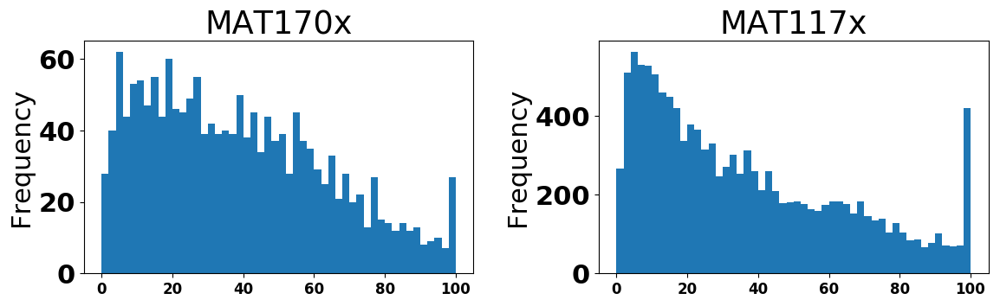
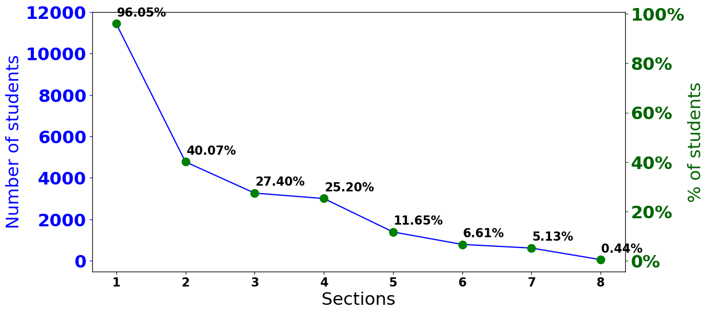
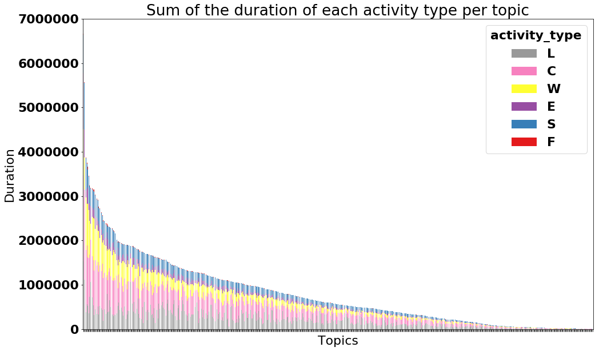
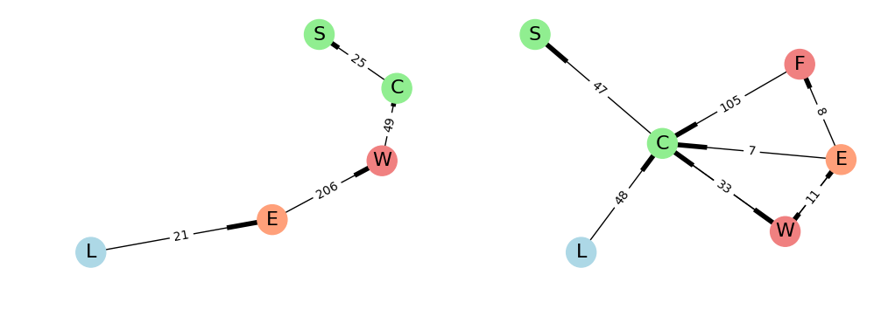
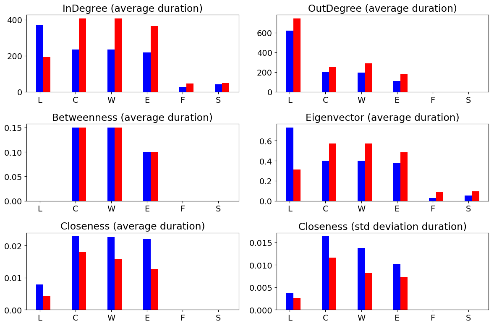
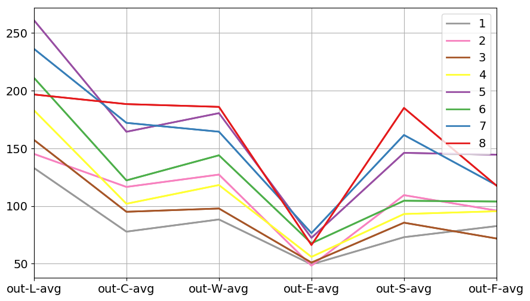
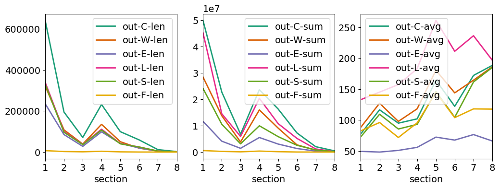

# Modelling Math Learning on an Open Access Intelligent Tutor

## ASU's Global Freshmen Academy

ASU Online offers 13 courses, great variety of schools (from Sociology to Astronomy)

**No Transcript | No Application | Pay tuition after | Same courses as on-campus**

Our analysis focuses on two MATH modules: 
* MAT117x: College Algebra and Problem Solving
* MAT170x: Precalculus


## ALEKS

These courses leverage the Assessment and LEarning in Knowledge Spaces (ALEKS) technology, a web-based assessment and learning system. ALEKS uses Artificial Intelligence to map the student's knowledge. ALEKS is based on knowledge spaces who describe the possible states of knowledge of a learner. This technology adapts and navigates each student by determining what the student may know/not know in a course and guides her to topics she is most ready to learn. Find out more at https://www.aleks.com/.

## Data

| Number | Desc |
| :-------------: | :-------------:|
| +15K | students |
| +40K | assessments |
| +8M | daily aggregate events of the topics learned and retained |
| ~190K | students mastering topics |
| +5M | transactions of students navigating through the concepts |

Students are assessed continuously while navigating through ALEKS

## Notebooks

1. [Intro](src/notebooks/1.%20Intro.ipynb): Intro to ASU's Global Freshman Academy (GFA), ALEKS, courses taught at ASU Online using ALEKS and data extracted
2. [Data Processing](src/notebooks/2.%20Data%20Preprocessing.ipynb): explore, graph and process the data not to use some empty dataset
3. [EDA](src/notebooks/3.%20EDA.ipynb): Exploratory Data Analysis
4. [Networks](src/notebooks/4.%20Networks.ipynb): Analysis using Networks and NetworkX
5. [Predictive Modelling](src/notebooks/5.%20Predictive%20Modelling.ipynb): Modelling
6. [HMM](src/notebooks/6.%20HMM.ipynb): Hidden Markov Models. 
7. [Clustering](src/notebooks/7.%20Clustering.ipynb): clustering topics based on their description

You can always view a notebook using https://nbviewer.jupyter.org/

## Figures

We grabbed a snapshot of the data between April 2016 and June 2017 as there was a gap afterwards.

**Course percentage finished by students:**


**Students working per section:**


**Ordered duration per topic colored by activity:**


**Student working on different topic and going through the learning states:**


**Comparing two topics with high C vs high W:**


**Comparing sections:**



## Web Application

The web app has been developed for exploring the data and results in an easy and powerful way using technologies like Flask for a web application using Python, MongoDB to store your enourmous amount of data, D3 to plot interactive graphs on the web using NVD3 and NetworkX to plot your networks visualizations using JSNetworkX.

## Technologies

* Python 3
* [Pandas](https://pandas.pydata.org/)
* [MongoDB](https://www.mongodb.com/)
* [Flask](http://flask.pocoo.org/)
* [Bootstrap](https://getbootstrap.com/)
* Javascript
* [D3](https://d3js.org/)
* [NVD3](http://nvd3.org/)
* [NetworkX](https://networkx.github.io/)
* [JSNetworkX](http://jsnetworkx.org/)

## Deployment

### Virtual Environment using Bash

1. Creation of a virtual environments done by executing the command venv
```
$ python3 -m venv env/
```

2. Command to activate virtual environment
```
$ source env/bin/activate
```

3. Install dependencies
```
(env) $ pip install -r requirements.txt
```

4. List the libraries installed on your environment
```
(env) $ pip freeze
```

5. Start your MongoDB
```
$ mongod
```

6. Connect to the MongoDB's CLI
```
$ mongo
...
> show dbs
...
> use predict_aleks
switched to db predict_aleks
> show tables
assessments
concepts
daily
mastery
paths
patterns
transactions
> db.assessments.findOne()
...
```

7. Store data, extract patterns and plot activity:
```
(env) $ python src/analytics/pipeline.py
```

8. Start Jupyter Notebook
```
(env) $ jupyter notebook
(env) $ ...
```

9. Start the development server
```
(env) $ python src/app.py
(env) $ ...
```

10. When you are done, the command to deactivate virtual environment
```
(env) $ deactivate
```
